	

<h1 align="center">Hi, I'm Susmit 👋</h1>

	Building cool things with clean code, curiosity, and caffeine.

	

	

	

	
	
	

	

	

- 💻 I enjoy turning ideas into practical, user-friendly products.
- 🧠 I am currently focused on improving my full-stack engineering skills.
- 🤝 I love collaborating on projects where code quality really matters.
- 🌱 Always learning, always shipping.

	

	

	

	
	

	

	
	
	

	

	
	
	
	
	
	

	

	
	
	
	
	

	

	

- Building meaningful personal projects
- Writing cleaner, more maintainable code
- Learning more about system design and backend architecture

	

	

	
	

	

	

	

	

	<picture>
		<source media="(prefers-color-scheme: dark)" srcset="https://raw.githubusercontent.com/sus130/sus130/output/github-contribution-grid-snake-dark.svg" />
		<source media="(prefers-color-scheme: light)" srcset="https://raw.githubusercontent.com/sus130/sus130/output/github-contribution-grid-snake.svg" />
		
	</picture>

	

	

	

	

	
	

---

<i>"Stay consistent. Small progress still compounds."</i>

	

